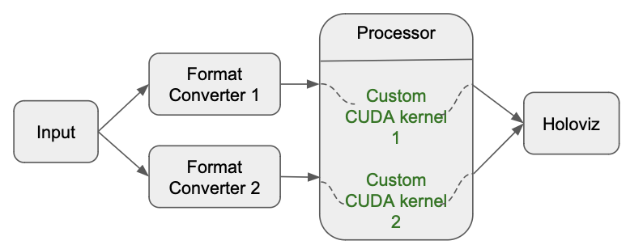

(custom-cuda-kernel-sample)=
# Custom Cuda Kernel Samples

There are 2 examples for custom CUDA kernel ingestion in the Holoscan SDK. These examples demonstrate usage of **InferenceProcessorOp** to ingest a custom CUDA kernel for processing.
- custom_cuda_kernel_1d_sample: Example shows ingestion of a single 1D custom CUDA kernel.
- custom_cuda_kernel_multi_sample: example shows ingestion of multiple custom CUDA kernels. Specifically a 1D and a 2D kernel are ingested through a single instance of the operator via parameter set. 

In these examples we'll cover:

- How to use parameter set with **InferenceProcessorOp** operator to ingest a custom CUDA kernel.
- Rules for writing custom CUDA kernel in the parameter set.

:::{note}
The example source code and run instructions can be found in the [examples](https://github.com/nvidia-holoscan/holoscan-sdk/blob/main/examples#holoscan-sdk-examples) directory on GitHub, or under `/opt/nvidia/holoscan/examples` in the NGC container and the Debian package, alongside their executables.
:::

## Operators and Workflow

Here is the diagram of the operators and workflow used in both the examples.

- custom_cuda_kernel_1d_sample: In the diagram below, the workflow input comes from video_replayer operator followed by format conversion via the format_converter operator. The inference processor operator then ingests and applies custom CUDA kernels and the result is then sent to the Holoviz operator for display. 

    


- custom_cuda_kernel_multi_sample: This sample has multiple custom CUDA kernels ingested into the workflow. In the diagram below, input in the workflow comes through the video_replayer operator. There are two instances of the format_converter operator that convert the format of the input data for the two custom CUDA kernels. The inference processor operator then ingests both the tensors from format converter operators, and applies custom CUDA kernels as per the specifications in the workflow. The result is then sent to the Holoviz operator for display. 

    


## Video Stream Replayer Operator

The built-in video stream replayer operator can be used to replay a video stream that has been encoded as GXF entities. You can use the `convert_video_to_gxf_entities.py` script (installed in `/opt/nvidia/holoscan/bin` or available [on GitHub](https://github.com/nvidia-holoscan/holoscan-sdk/tree/main/scripts#convert_video_to_gxf_entitiespy)) to encode a video file as GXF entities for use by this operator.

This operator processes the encoded file sequentially and supports realtime, faster than realtime, or slower than realtime playback of prerecorded data. The input data can optionally be repeated to loop forever or only for a specified count. For more details, see {cpp:class}`~holoscan::ops::VideoStreamReplayerOp`.

We will use the replayer to read GXF entities from disk and send the frames downstream to the Holoviz operator.

## Format Converter Operator

The built-in format converter operator converts the size and datatype of the incoming tensor. 

## Processor Operator

Inference Processor operator (`InferenceProcessorOp`) is designed using APIs from Holoscan Inference Component. The operator performs data processing operations specifically for inference examples in Holoscan SDK. The Inference Processor operator is updated to ingest custom CUDA kernels written by the user. The user must follow the conventions described below when designing and using custom CUDA kernels:

- Custom Cuda Kernel name must be: custom_cuda_kernel-*identifier*. E.g. A custom CUDA kernel with identifier as 1 must be named as custom_cuda_kernel-1. The identifier must be unique for all the custom kernels and is used in defining the kernels further in the parameter set.

- Named custom CUDA kernel is invoked in the parameter set as shown below. Custom CUDA operation is mapped to the input tensor **input_tensor** via **process_operations** map in the parameter set. 

    ```yaml
    processor_op:
        process_operations:
            "input_tensor": ["custom_cuda_kernel-1"]
    ```

- Custom CUDA kernel is defined using **custom_kernels** map in the parameter set. 
    
    ```yaml
    processor_op:
        cuda_kernels:
            cuda_kernel-1: |
                        extern "C" __global__ void customKernel1(const unsigned char* input, 
                                                                unsigned char* output, int size) {}
            out_dtype-1: "kUInt8"
            thread_per_block-1: "256"
    ```

    - Custom CUDA kernel is defined with key cuda_kernel-*identifier*. In the example above, CUDA kernel with identifier **1** is defined using the key **cuda_kernel-1** in the **cuda_kernels** parameter.
        - Custom CUDA kernel name must follow the following convention: *customKernelIdentifier*. For e.g in the example in the parameter set above, function name is *customKernel1* with identifier *1*.
        - Function name must be preceded: by `extern "C"` and the `__global__` keyword as shown in the example above.
        - Multi dimensional custom CUDA kernels are supported, though function arguments support is limited to the following:
            - 1D: (const void* input, void* output, int size)
            - 2D: (const void* input, void* output, int width, int height)
            - 3D: (const void* input, void* output, int width, int height, int depth)
        - Output buffer allocation is of same size as input. Customized buffer dimension support will come in future releases.
        - Custom CUDA kernel can be ingested via a filepath or a string. If the custom CUDA kernel is ingested via a filepath, the operator will read the kernel from the file. If the custom CUDA kernel is ingested via a string in the parameter set, the operator will use the kernel from the string. Filepath must end with **.cu** extension. All specifications for the kernel must be present in the file.
    - Output data type for custom CUDA kernel with identifier **1** is defined as **out_dtype-1**.
        - Options: kFloat32, kFloat16, kUInt8, kInt8, kInt32, kInt64
    - Threads per block for custom CUDA kernel with identifier **1** is defined with key **thread_per_block-1**.  By default, custom CUDA kernel is 1D and if this parameter is not specified, the operator will assume it to be a 1D kernel with 256 threads. 
    - **threads_per_block-identifier** parameter in the **cuda_kernels** map is used in identifying the dimension of the kernel. For a 2D kernel, this parameter must be present with 2 values of threads per block (in x and y dimension) separated by a comma (,). For e.g. *thread_per_block-identifier: "16,16"*. Similarly for a 3D kernel, *thread_per_block-identifier: "8,8,8"*.
- Multi Custom CUDA kernel support: User can create one of more custom CUDA kernel in the same instance of the **InferenceProcessorOp** and can define it in the same parameter set.
    ```yaml
    processor_op:
        process_operations:
            "input_tensor": ["custom_cuda_kernel-1"]
        cuda_kernels:
            cuda_kernel-1: |
                        extern "C" __global__ void customKernel1(const unsigned char* input, 
                                                                unsigned char* output, int size) {}
            out_dtype-1: "kUInt8"
            thread_per_block-1: "256"
            cuda_kernel-2: |
                        extern "C" __global__ void customKernel2(const unsigned char* input, 
                                                                unsigned char* output, int size) {}
            out_dtype-2: "kUInt8"
            thread_per_block-2: "16,16"
    ```
    - In the example above, two custom CUDA kernels are defined. *cuda_kernel-1* is 1D and *custom_kernel-2* is a 2D kernel, they both are used in the same parameter set. 
- Templated kernels are not supported in this release. 
- Custom CUDA kernel can be ingested via a filepath or a string. If the custom CUDA kernel is ingested via a filepath, the operator will read the kernel from the file. If the custom CUDA kernel is ingested via a string in the parameter set, the operator will use the kernel from the string. Filepath must end with **.cu** extension. All specifications for the kernel must be present in the file.
- Multiple custom CUDA kernels chaining is supported. For a particular input tensor, multiple custom CUDA kernels can be defined in the parameter set. Custom CUDA kernels are executed in the order of their definition in the parameter set. For e.g. custom_cuda_kernel-1 and custom_cuda_kernel-2 are two custom CUDA kernels defined in the parameter set. The output of custom_cuda_kernel-1 is used as input for custom_cuda_kernel-2. Custom CUDA kernels are separated by a colon (:) as shown below.
    ```yaml
    processor_op:
        process_operations:
            "input_tensor": ["custom_cuda_kernel-1:custom_cuda_kernel-2"]
    ```
    
## Holoviz Operator

The built-in Holoviz operator provides the functionality to composite realtime streams of frames with multiple different other layers like segmentation mask layers, geometry layers and GUI layers.
We will use Holoviz to display frames that have been sent by the replayer operator and processor operator to its "receivers" port which can receive any number of inputs.  

## Running the Application

Running the application should bring up holoviz display for each of the example as shown below.

- custom_cuda_kernel_1d_sample: This example shows the input frame and grayscale of the input frame side by side. Grayscale conversion is executed by the custom CUDA kernel.

    

- custom_cuda_kernel_multi_sample: This example shows the input frame and grayscale of the input frame, followed by edge detection in the frame. Grayscale conversion is executed by a 1D CUDA kernel, edge detection is performed by a customized 2D CUDA kernel.

    

